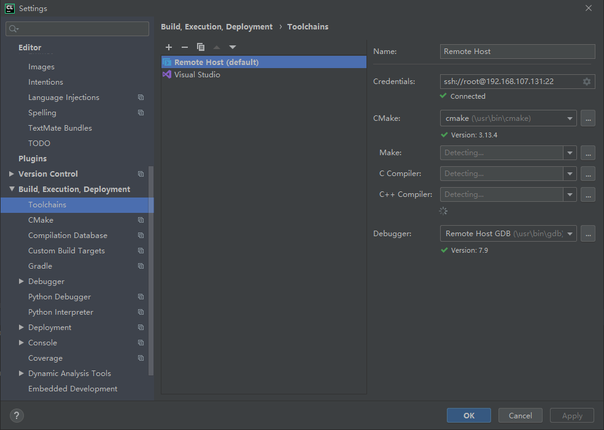
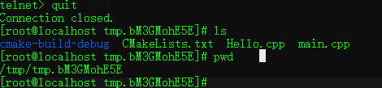

## Clion远程开发环境配置

* Clion 版本 CLion 2019.3.2

* Cmake 3.x 以上

* gdb 7.8.x 以上

* centos7.x以上(建议虚拟机,速度快)

>```shell
>##clion2019.3.2需要cmake3.x,移除老版本cmake
>yum remove cmake
>##安装必要依赖
>yum install -y gcc g++ gcc-c++ make automake texinfo wget
>##拉取cmake源码
>wget https://cmake.org/files/v3.13/cmake-3.13.4.tar.gz
>##解包
>tar -xf cmake-3.13.4.tar.gz
>##安装
>cd cmake-3.13.4
>./configure
>make
>make install
>##设置软连接,clion默认/usr/bin/cmake目录,但默认安装位置在/usr/local/bin/cmake
>ln -s /usr/local/bin/cmake /usr/bin/cmake
>##安装termcap,gdb必要依赖
>wget https://ftp.gnu.org/gnu/termcap/termcap-1.3.1.tar.gz
>tar -xf termcap-1.3.1.tar.gz
>cd termcap-1.3.1
>./configure
>make
>sudo make install
>##...
>yum remove -y gdb
>wget http://mirrors.ustc.edu.cn/gnu/gdb/gdb-7.9.tar.xz
>tar -xf gdb-7.9.tar.xz
>cd gdb-7.9
>./configure
>make install
>ln -s /usr/local/bin/gdb /usr/bin/gdb 
>```
>
>


**所有环境均为远程环境,操作作用于远程服务器.**

**工程文件夹对应远程服务器的temp/xxxx**



参考自https://blog.csdn.net/q1009020096/article/details/87715273