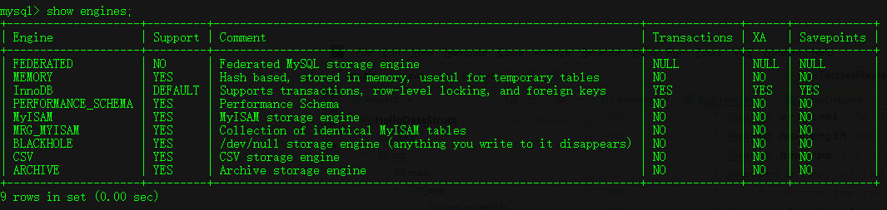

# Mysql 存储引擎

> ```sql
> show engines; //显示所有存储引擎
> ```
>
>   
>
> **InnoDB 为Mysql默认支持的存储引擎**
>
> > 支持事物,行级锁,和外键
>
> ```sql
> //查看表使用的存储引擎
> show table status from dbname;
> show create table table_name;
> ```
>
> ```sql
> //改变表使用的存储引擎
> alter table table_name engine=engine_name;
> ```
>
> 