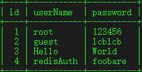
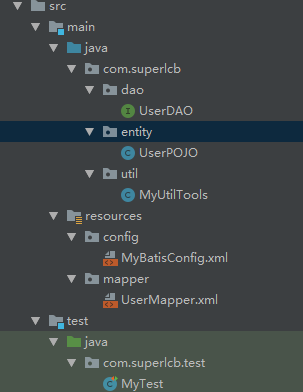

**Table of Contents**  *generated with [DocToc](https://github.com/thlorenz/doctoc)*

- [Mybatis Study](#mybatis-study)
  - [1.mybatis 简介](#1-mybatis)
  - [2.Hello Mybatis](#2hello-mybatis)
  - [MyBatis 全局配置文件](#3.mybatis-%E5%85%A8%E5%B1%80%E9%85%8D%E7%BD%AE%E6%96%87%E4%BB%B6)


# Mybatis Study

## 1.mybatis 简介

> 
>
> MyBatis 本是[apache](https://baike.baidu.com/item/apache/6265)的一个开源项目[iBatis](https://baike.baidu.com/item/iBatis), 2010年这个项目由apache software foundation 迁移到了google code，并且改名为MyBatis 。2013年11月迁移到Github。
>
> iBATIS一词来源于“internet”和“abatis”的组合，是一个基于Java的[持久层](https://baike.baidu.com/item/持久层/3584971)框架。iBATIS提供的持久层框架包括SQL Maps和Data Access Objects（DAOs）
>
> 
>
> 当前，最新版本是MyBatis 3.5.2 ，其发布时间是2019年7月15日。
>
> * 基本信息
>
>   > MyBatis 是一款优秀的持久层框架，它支持定制化 SQL、存储过程以及高级映射。MyBatis 避免了几乎所有的 JDBC 代码和手动设置参数以及获取结果集。MyBatis 可以使用简单的 XML 或注解来配置和映射原生信息，将接口和 Java 的 POJOs(Plain Ordinary Java Object,普通的 Java对象)映射成数据库中的记录
>
> * 特点
>
>   > MyBatis 是支持普通 SQL查询，[存储过程](https://baike.baidu.com/item/存储过程)和高级映射的优秀[持久层](https://baike.baidu.com/item/持久层)框架。MyBatis 消除了几乎所有的[JDBC](https://baike.baidu.com/item/JDBC)代码和参数的手工设置以及[结果集](https://baike.baidu.com/item/结果集)的检索。MyBatis 使用简单的 XML或注解用于配置和原始映射，将接口和 Java 的POJOs（Plain Ordinary Java Objects，普通的 Java对象）映射成数据库中的记录。
>   >
>   > 每个MyBatis应用程序主要都是使用Sql[Session](https://baike.baidu.com/item/Session)Factory实例的，一个SqlSessionFactory实例可以通过SqlSessionFactoryBuilder获得。SqlSessionFactoryBuilder可以从一个xml配置文件或者一个预定义的配置类的实例获得。
>   >
>   > 用xml文件构建SqlSessionFactory实例是非常简单的事情。推荐在这个配置中使用类路径资源（classpath resource)，但你可以使用任何Reader实例，包括用文件路径或file://开头的url创建的实例。MyBatis有一个实用类----Resources，它有很多方法，可以方便地从类路径及其它位置加载资源。
>
> ***[参考百度百科](https://baike.baidu.com/item/MyBatis/2824918?fr=aladdin)***

## 2.Hello Mybatis

* **环境**

  > * IntelliJ IDEA 2019.1.1
  >* java 11.0.3 2019-04-16 LTS
  > * Gradle 5.5.1
  > * mysql  Ver 8.0.15 for Win64 on x86_64 (MySQL Community Server - GPL)

* **数据库**

```sql
//数据库表
CREATE TABLE `myuser` (
  `id` int(11) NOT NULL AUTO_INCREMENT,
  `userName` varchar(20) DEFAULT NULL,
  `password` varchar(20) DEFAULT NULL,
  PRIMARY KEY (`id`)
) ENGINE=InnoDB AUTO_INCREMENT=5 DEFAULT CHARSET=utf8

```

*数据库字段值*


* **工程目录**



* **gradle依赖**

```gradle
 implementation 'org.mybatis:mybatis:3.5.2'
 implementation 'mysql:mysql-connector-java:8.0.16'
```


* **mybatis主配置文件**

```xml
<?xml version="1.0" encoding="UTF-8" ?>
<!DOCTYPE configuration
        PUBLIC "-//mybatis.org//DTD Config 3.0//EN"
        "http://mybatis.org/dtd/mybatis-3-config.dtd">
<configuration>
    <environments default="development">
        <environment id="development">
            <transactionManager type="JDBC"/>
            <dataSource type="POOLED">
                <property name="driver" value="com.mysql.cj.jdbc.Driver"/>
                <property name="url" value="jdbc:mysql://localhost:3306/test?serverTimezone=GMT%2B8&amp;useSSL=false&amp;useUnicode=true&amp;characterEncoding=utf8" />
                <property name="username" value="root"/>
                <property name="password" value="123456"/>
            </dataSource>
        </environment>
    </environments>
    <mappers>
        <mapper resource="mapper/UserMapper.xml"></mapper>
    </mappers>
</configuration>
```


* **实体类**

  ```java
  package com.superlcb.entity;
  
  /***
   * @author: lcb
   * @date: 2019-7-18 20:13
   * Description: 
   */
  public class UserPOJO {
      private Integer id=null;
      private String userName=null;
      private String password=null;
  
      @Override
      public String toString() {
          return "UserPOJO{" +
                  "id=" + id +
                  ", userName='" + userName + '\'' +
                  ", password='" + password + '\'' +
                  '}';
      }
  
      public UserPOJO() {
      }
  
      public Integer getId() {
          return id;
      }
  
      public void setId(Integer id) {
          this.id = id;
      }
  
      public String getUserName() {
          return userName;
      }
  
      public void setUserName(String userName) {
          this.userName = userName;
      }
  
      public String getPassword() {
          return password;
      }
  
      public void setPassword(String password) {
          this.password = password;
      }
  }
  ```

* **DAO 接口**

```java
package com.superlcb.dao;

import com.superlcb.entity.UserPOJO;

/***
 * @author: lcb
 * @date: 2019-7-18 20:14
 * Description: 
 */
public interface UserDAO {
    UserPOJO[] selectAllUsers();
}
```

* **Mapper映射文件**

```xml
<?xml version="1.0" encoding="UTF-8" ?>
<!DOCTYPE mapper
        PUBLIC "-//mybatis.org//DTD Mapper 3.0//EN"
        "http://mybatis.org/dtd/mybatis-3-mapper.dtd">
<mapper namespace="com.superlcb.dao.UserDAO">
    <select id="selectAllUsers" resultType="com.superlcb.entity.UserPOJO">
        select id,userName,password from myuser
    </select>
</mapper>
```

* **测试方法**

```java
package com.superlcb.test;

import com.superlcb.dao.UserDAO;
import com.superlcb.entity.UserPOJO;
import com.superlcb.util.MyUtilTools;
import org.apache.ibatis.io.Resources;
import org.apache.ibatis.session.SqlSession;
import org.apache.ibatis.session.SqlSessionFactory;
import org.apache.ibatis.session.SqlSessionFactoryBuilder;
import org.junit.After;
import org.junit.Before;
import org.junit.Test;

import java.io.FileNotFoundException;
import java.io.IOException;
import java.io.InputStream;

/***
 * @author: lcb
 * @date: 2019-7-18 19:44
 * Description: 
 */
public class MyTest {
    private String mybatisConfigFilePath= "config/MyBatisConfig.xml";
    private SqlSessionFactory sqlSessionFactory=null;
    private SqlSession sqlSession=null;
    @Before
    public void testBeforeMethod(){
        try {
            //使用Mybatis工具类Resources通过字符串获取配置文件输入流
            InputStream in= Resources.getResourceAsStream(mybatisConfigFilePath);
            //构建者模式生成SqlSessionFactory
            sqlSessionFactory=new SqlSessionFactoryBuilder().build(in);
            //打开一次SqlSession
            sqlSession=sqlSessionFactory.openSession();
        } catch (FileNotFoundException e) {
            e.printStackTrace();
        } catch (IOException e) {
            e.printStackTrace();
        }
    }
    /***
     * @author: lcb
     * @date : 2019-7-18 20:32
     * MethodDescription:
     */
    @Test
    public void testHelloMybatis(){
        UserDAO userDAO = sqlSession.getMapper(UserDAO.class);
        UserPOJO[] userPOJOs = userDAO.selectAllUsers();
        MyUtilTools.myPrint(userPOJOs);
    }
    @After
    public void testAfterMethod(){
        //关闭SqlSession
        sqlSession.close();
    }
}
```

* **运行结果**

```reStructuredText
UserPOJO{id=1, userName='root', password='123456'}
UserPOJO{id=2, userName='guest', password='lcblcb'}
UserPOJO{id=3, userName='Hello', password='World'}
UserPOJO{id=4, userName='redisAuth', password='foobare'}
```

## 3.MyBatis 全局配置文件

* 