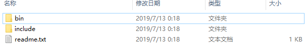

# protobuf 学习

> ### What are protocol buffers?
>
> Protocol buffers are Google's language-neutral, platform-neutral, extensible mechanism for serializing structured data – think XML, but smaller, faster, and simpler. You define how you want your data to be structured once, then you can use special generated source code to easily write and read your structured data to and from a variety of data streams and using a variety of languages.
>
> 简而言之Protobuf更快更好
>
> ---
>
> ### Pick your favorite language
>
> Protocol buffers currently support generated code in Java, Python, Objective-C, and C++. With our new proto3 language version, you can also work with Dart, Go, Ruby, and C#, with more languages to come.
>
> 支持多种语言
>
> ---
>
> 摘自官网***https://developers.google.com/protocol-buffers***

***protobuf有两个版本proto2和proto3***

**显然proto3更强大 所以以下介绍proto3的安装和使用**

## Protobuf3 windows下的安装

> 我这里使用最新的`protoc-3.9.0-win64.zip` 版本`protoc-3.9.0-win64.zip`。下载地址：***https://github.com/protocolbuffers/protobuf/releases/tag/v3.9.0***

* **目录结构**

  

* **将bin目录配到环境变量里面去,方便使用**

  ### HelloProtoBuf

* **编写.proto文件**

```protobuf
syntax = "proto3";


message User{
	string username = 1;
	string password = 2;
}
```

* *protoc --java_out  .  User.proto* 编译文件生成UserOuerClass.java 文件  

* ***引入maven依赖***

  ```xml
        <dependency>
            <groupId>com.google.protobuf</groupId>
            <artifactId>protobuf-java</artifactId>
            <version>3.9.0</version>
        </dependency>
  ```

* ***序列化代码***

  ```java
  UserOuterClass.User user=UserOuterClass.User.newBuilder()
      .setPassword("Hello").setUsername("World").build();//构建User类
  user.toByteArray().length;//序列化成字节
  ```

  