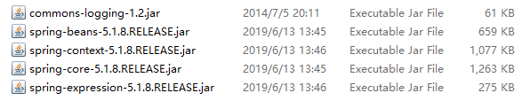
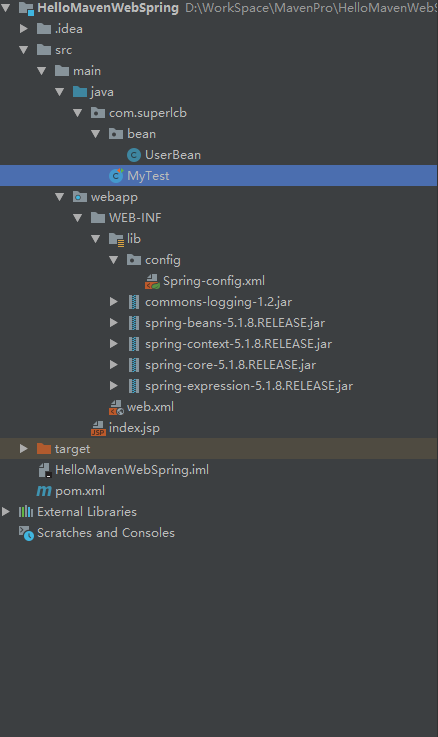

# Spring Study

* 简介

  > Spring是一个开放[源代码](https://baike.baidu.com/item/源代码/3969)的设计层面框架，它解决的是业务逻辑层和其他各层的松耦合问题，因此它将面向接口的编程思想贯穿整个系统应用。Spring是于2003 年兴起的一个轻量级的Java 开发框架，由Rod Johnson创建。简单来说，Spring是一个分层的JavaSE/EE **full-stack(****一栈式)** [轻量级](https://baike.baidu.com/item/轻量级/10002835)开源框架。
  >
  > ​																	***参考百度百科***

* 环境搭键

  > 
  >
  > 1.  commons-logging
  >
  > 2. spring-beans
  >
  > 3. spring-context
  >
  > 4. spring-core
  >
  > 5. spring-expringssion
  >
  >    ### maven 导入
  >
  >    >```xml
  >    ><!-- https://mvnrepository.com/artifact/commons-logging/commons-logging -->
  >    ><dependency>
  >    >    <groupId>commons-logging</groupId>
  >    >    <artifactId>commons-logging</artifactId>
  >    >    <version>1.2</version>
  >    ></dependency>
  >    >
  >    ><!-- https://mvnrepository.com/artifact/org.springframework/spring-context -->
  >    ><dependency>
  >    >    <groupId>org.springframework</groupId>
  >    >    <artifactId>spring-context</artifactId>
  >    >    <version>5.1.7.RELEASE</version>
  >    ></dependency>
  >    >
  >    >
  >    >```
  >
  >    ### 配置文件
  >
  >    
  >
  >    ```XML
  >    <?xml version="1.0" encoding="UTF-8"?>
  >    <beans xmlns="http://www.springframework.org/schema/beans"
  >           xmlns:xsi="http://www.w3.org/2001/XMLSchema-instance"
  >           xsi:schemaLocation="http://www.springframework.org/schema/beans
  >            https://www.springframework.org/schema/beans/spring-beans.xsd">
  >    
  >    </beans>
  >    ```

* 入门代码

  >工程结构
  >
  >
  >
  >```java
  >ApplicationContext context=new ClassPathXmlApplicationContext("config/Spring-config.xml");
  >UserBean userBean = (UserBean)context.getBean("UserBean");
  >System.out.println(userBean==null);
  >```

