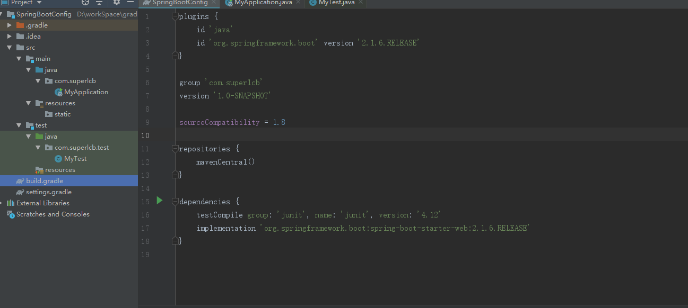

#  SpringBoot Study

## 1. SpringBoot简介

> SpringBoot是由Pivotal团队在2013年开始研发、2014年4月发布第一个版本的全新开源的轻量级框架。它基于Spring4.0设计，不仅继承了Spring框架原有的优秀特性，而且还通过简化配置来进一步简化了Spring应用的整个搭建和开发过程。另外SpringBoot通过集成大量的框架使得依赖包的版本冲突，以及引用的不稳定性等问题得到了很好的解决。

**特点**

* 可以创建独立的[Spring](https://baike.baidu.com/item/Spring/85061)应用程序，并且基于其Maven或Grandel插件，可以创建可执行的JARs和WARs

* 内嵌Tomcat或Jetty等Servlet容器

* 提供自动配置的“starter”项目对象模型（POMS）以简化[Maven](https://baike.baidu.com/item/Maven/6094909)配置

* 尽可能自动配置Spring容器

* 提供准备好的特性，如指标、健康检查和外部化配置

* 绝对没有代码生成，不需要XML配置

  ***[Spring官网](https://spring.io/projects/spring-boot/)***

  ***[参考百度百科](https://baike.baidu.com/item/Spring%20Boot/20249767?fr=aladdin)***

## 2. 环境搭建

> **idea + jdk11 + gradle5.5.1 创建Java工程
>
> 

* **插件**

  ```groovy
  apply plugin: 'io.spring.dependency-management'
  id 'org.springframework.boot' version '2.1.6.RELEASE'
  //maven
  <plugin>
  				<groupId>org.springframework.boot</groupId>
  				<artifactId>spring-boot-maven-plugin</artifactId>
  </plugin>
  ```

* **web依赖**

  ```groovy
  implementation 'org.springframework.boot:spring-boot-starter-web:2.1.6.RELEASE'
  //maven
    <parent>
      <groupId>org.springframework.boot</groupId>
      <artifactId>spring-boot-starter-parent</artifactId>
      <version>2.1.6.RELEASE</version>
    </parent>
  ```

* **启动类**

  ```java
  package com.superlcb;
  
  import org.springframework.boot.SpringApplication;
  import org.springframework.boot.autoconfigure.SpringBootApplication;
  
  /***
   * @author: lcb
   * @date: 2019-7-17 12:35
   * Description: 
   */
  @SpringBootApplication
  public class MyApplication {
      public static void main(String[] args) {
          SpringApplication.run(MyApplication.class,args);
      }
  }
  ```

  ***[查找依赖坐标](https://search.maven.org/)***

  ## YMAL 语法

* **简介**

  > YAML（/ˈjæməl/，尾音类似 camel ) 是**“****YAML不是一种标记语言****”**的外语缩写 [1]  （见前方参考资料原文内容）；但为了强调这种语言以数据做为中心，而不是以置标语言为重点，而用[返璞词](https://baike.baidu.com/item/返璞词/4213421)重新命名。它是一种直观的能够被电脑识别的数据序列化格式，是一个可读性高并且容易被人类阅读，容易和[脚本语言](https://baike.baidu.com/item/脚本语言/1379708)交互，用来表达资料序列的编程语言。

* **对象(Object)表示**

```yaml
Person: 
	id: 001
	name: Tom
	age: 13
```

* **Map表示**

```yaml
price: 
	apple: 11
	orange: 12
	banana: 13
#行内表示法
price: {apple: 11,orange: 12,banana: 13}
```

* **Set和List表示**

```yaml
ProgramLanguege:
	- java
	- C#
	- Python
	- javaScript
	- C
	- C++
#行内表示法
ProgramLanguage: [java,C#,python,JavaScript,C,C++]
```

