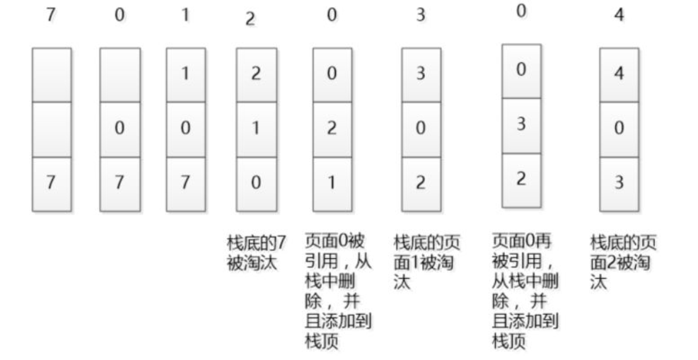

##                                        LRU 缓存淘汰算法

## LRU简介

> LRU是Least Recently Used的缩写，即最近最少使用，是一种常用的[页面置换算法](https://baike.baidu.com/item/页面置换算法/7626091)，选择最近最久未使用的页面予以淘汰。该算法赋予每个[页面](https://baike.baidu.com/item/页面/5544813)一个访问字段，用来记录一个页面自上次被访问以来所经历的时间 t，当须淘汰一个页面时，选择现有页面中其 t 值最大的，即最近最少使用的页面予以淘汰。
>
> [参考百度百科](https://baike.baidu.com/item/LRU/1269842?fr=aladdin)

## LRU应用

> 减小磁盘IO提高数据访问速度,例如操作系统的磁盘缓存,以及Redis缓存淘汰机制

## LRU原理

> 

## LRU Java代码实现

