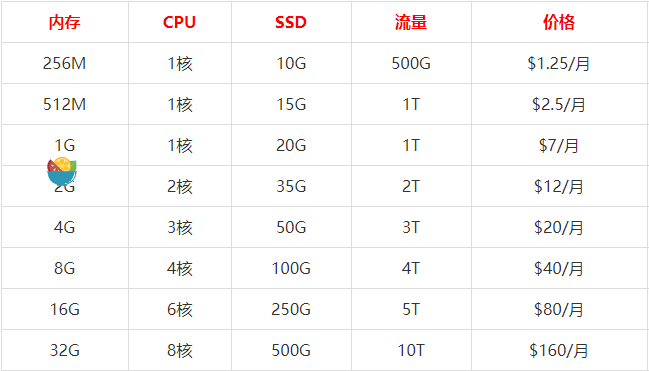

#        SSR服务器搭建教程

* ### 超低价VPS商家virmach：支持Alipay支付宝付款

> [virmach](https://www.zhujiceping.com/tag/virmach/)是这三四年年来崛起最快的低端VPS行业的领头羊了，可以说[virmach](https://www.zhujiceping.com/tag/virmach/)的VPS是前无古人的低价格，基本挑战了VPS行业的价格底限；virmach的分布在全球的10个数据中心，每台服务器都是1Gbps带宽，solusvm面板，超便宜的ddos防御（低至每个月2美元，可以享受500Gbps的ddos防护）；最重要的，售后态度友好，ticket回复相当快。从今天开始，virmach正式支持支付宝付款了，中国用户随意买！
>
> 参考自  *https://www.zhujiceping.com/25893.html*

* ### **官方网站**： [www.virmach.com](https://billing.virmach.com/aff.php?aff=203)

* ### 配置

  ### 

>  *** 注意够买后操作系统默认为Debian7要更换为Debian9否则软件版本过旧无法安装 ***

* 安装SSR

  > ```shell
  > wget --no-check-certificate https://freed.ga/github/shadowsocksR.sh; 
  > bash shadowsocksR.sh
  > ```

* ### 配置文件

> /etc/shadowsocks.json
>
> ```json
> {
>     "server": "0.0.0.0",
>     "server_ipv6": "::",
>     "server_port": 25565,
>     "local_address": "127.0.0.1",
>     "local_port": 1081,
>     "password": "lcblcb",
>     "timeout": 120,
>     "udp_timeout": 60,
>     "method": "aes-256-cfb",
>     "protocol": "auth_sha1_v4_compatible",
>     "protocol_param": "",
>     "obfs": "http_simple_compatible",
>     "obfs_param": "",
>     "dns_ipv6": false,
>     "connect_verbose_info": 1,
>     "redirect": "",
>     "fast_open": false,
>  	"workers": 1
> }
> ```

* ### 多用户配置

> ```json
>  {
>     "server": "0.0.0.0",
>     "server_ipv6": "::",
>     "local_address": "127.0.0.1",
>     "local_port": 1081,
> 	"port_password": {
> 		"8081": "windows",
> 		"8082": "android",
> 		"8083": "guest"
> 	},
>     "timeout": 120,
>     "udp_timeout": 60,
>     "method": "aes-256-cfb",
>     "protocol": "auth_sha1_v4_compatible",
>     "protocol_param": "",
>     "obfs": "http_simple_compatible",
>     "obfs_param": "",
>     "dns_ipv6": false,
>     "connect_verbose_info": 1,
>     "redirect": "",
>     "fast_open": false,
>  	"workers": 1
> }
> ```
>
> 

