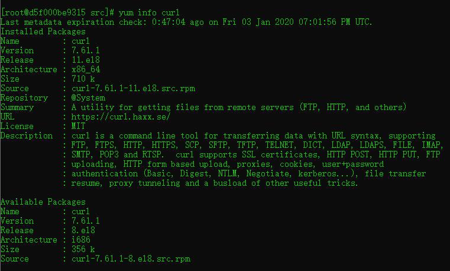

# Linux yum使用详解

## 1.简介

> yum（ Yellow dog Updater, Modified）是一个在Fedora和RedHat以及SUSE中的Shell前端软件包管理器。
>
> 基於RPM包管理，能够从指定的服务器自动下载RPM包并且安装，可以自动处理依赖性关系，并且一次安装所有依赖的软体包，无须繁琐地一次次下载、安装。
>
> yum提供了查找、安装、删除某一个、一组甚至全部软件包的命令，而且命令简洁而又好记。

## 2.常用命令

```shell
yum install package_name   #安装一个包
yum update					#更新所有软件
yum update package_name		#更新指定软件包
yum upgrade					#升级所有的软件包
yum repolist				#查看所有的软件源
yum list					#列出已安装或可安装的包
yum list package_name
yum list installed
yum remove
yum info pacakge_name      #查看指定包的信息(已安装或可安装)
yum provides package_name  #找出软件包所在套件
yum check-update			#检查更新
yum clean					#清除缓存
yum deplist package_name    #查看指定包的依赖					
```

## 3.实例

* **yum info package_name**



